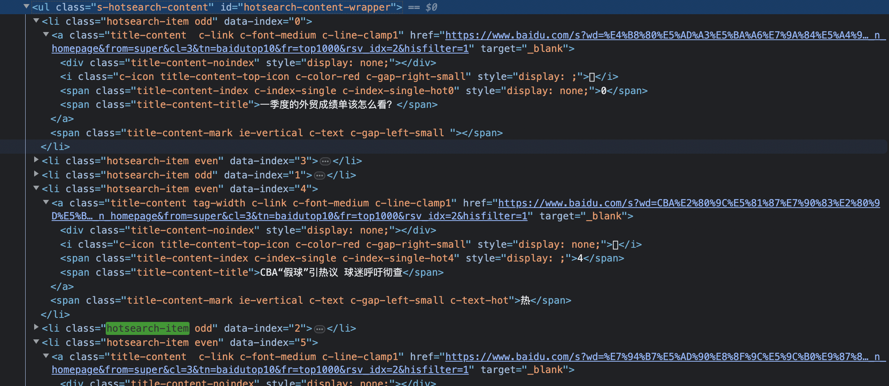

goquery 是用来html解析的，基于github.com/andybalholm/cascadia和golang.org/x/net/html库，使用的是css选择器语法来查找标签。

### 安装

`go get -u github.com/PuerkitoBio/goquery`

### 使用

```go
package main

import (
	"fmt"
	"github.com/PuerkitoBio/goquery"
	"log"
	"net/http"
)

func main() {

	res, err := http.Get("http://www.baidu.com")
	if err != nil {
		log.Fatal(err)
	}

	defer res.Body.Close()
	if res.StatusCode != 200 {
		log.Fatalf("status code error: %d", res.StatusCode)
	}

	doc, err := goquery.NewDocumentFromReader(res.Body)
	if err != nil {
		log.Fatal(err)
	}

	doc.Find(".s-hotsearch-content .hotsearch-item").Each(func(i int, s *goquery.Selection) {

		content := s.Find(".title-content-title").Text()
		fmt.Printf("%d: %s \n", i, content)
    href, suc := s.Attr("data-index")
		fmt.Println("attr", href, suc)
    s.SetAttr("data-index", "666")
		href, suc = s.Attr("data-index")
		fmt.Println("attr", href, suc)
    s.RemoveAttr("data-index")
		href, suc = s.Attr("data-index")
		fmt.Println("attr", href, suc)

	})

}
```



####  对象

1. `goquery.NewDocumentFromReader(res.Body)` 通过网络请求回来的body传入。
2. 如果是本地已经下载好的html文件，可以使用先用`strings.NewReader("")`把string类型的html文档转换成实现了io.reader接口的Reader类型。然后在传给`goquery.NewDocumentFromReader(doc_html)`。

#### 定位标签

1. `Find(".s-hotsearch-content .hotsearch-item")` 通过使用css选择器语法，返回的是一个*Selection的指针类型，会返回所有找到的标签结果。
2. `Each(func(i int, s *goquery.Selection)` 是遍历所有的结果，如果只要第一个可以使用`First()`。
3. 看html 标签li的class是"hotsearch-item even" 这个的意思是类名有多个，多个类名之间用空格隔开。

#### 查找属性

1. 如果要查找标签的属性可以使用 `s.Attr("data-index")` 方法

#### 查找内容

1. 如果要查找标签的内容可以使用`Text()` 方法。

#### 修改属性

1. 修改属性可以用`SetAttr()`方法。

#### 删除

1. 删除属性可以用 `RemoveAttr()`。
2. 删除标签可以用 `Remove()`

#### 转码

如果下载的的html不是utf8格式的，需要先转码。可以用github.com/djimenez/iconv-go转。


